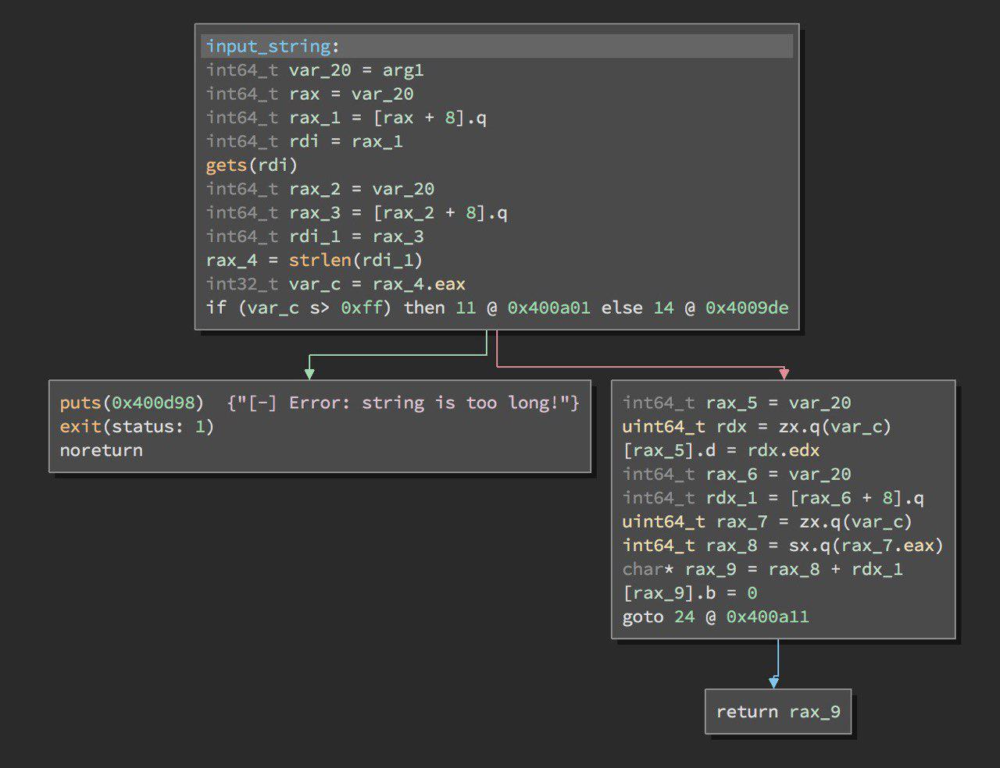

# guessing (pwn300)
In this task we are given a x86\_64 ELF binary and libc.

### TL;DR
- Overwrite `got.plt.rand` to main address
- Overwrite least byte of string pointer in heap to get control of pointer itself then leak address of libc functions
- Overwrite `got.plt.exit` to simple return gadget
- Overwrite `got.plt.strlen` to `system`

 
 Logic of task is pretty simple - read two strings which buffers is allocated on heap, then ask the user to guess 10 random numbers (this part of binary mostly useless).
 Input function:
 
 As we can see, the string can't be overflown in a simple way because of string length check... or can it? The trick is pretty simple - `gets` wouldn't stop reading from stdin if it reach null-byte, but strlen would. So to bypass this check we simply need to send something like this `\x00 + payload`.
 Well now we can overflow strings and pass the check, considering the fact that our strings located continously in heap like this:

 ```
 DWORD - length of string1
 4 BYTES - alignment
 QWORD - pointer to string1
 256 BYTES - string1 buffer
 DWORD - length of string2
 4 BYTES - alignment
 QWORD - pointer to string2
 256 BYTES - string2 buffer
 ```
 Thus we can overwrite pointer to string2 and gain arbitrary write. Things we want to overwrite:
 - Pointer to `libc_random` function to the address of `main` function to get few tries of writing/reading
 - Pointer to `libc_strlen` to `libc_system`
 - Pointer to `libc_exit` to something that JUST DON'T SCREW EXECUTION OF OUR PROCESS, purposes of this i'll describe a bit later

 To get arbitary read we need:
 - With first input_read overwrite least byte of string2 pointer to null, so it makes string2 pointer to point in the middle of our string1 buffer
 - With second input_read overwrite whole string2 pointer to address of something you want to read, in this case it would .got.plt

 With abitary read and write and given `libc.so` file we can leak `libc_base` address and then overwrite `strlen` to `system`. And last but not least - as we overwrote strlen to system it would probably called with string pointed somewhere in `.got.plt` so it would return -1 or something, in this case we wouldn't pass length check so that's why we need to overwrite `exit` to something dummy.

 Here is my [exploit](./spl.py).

